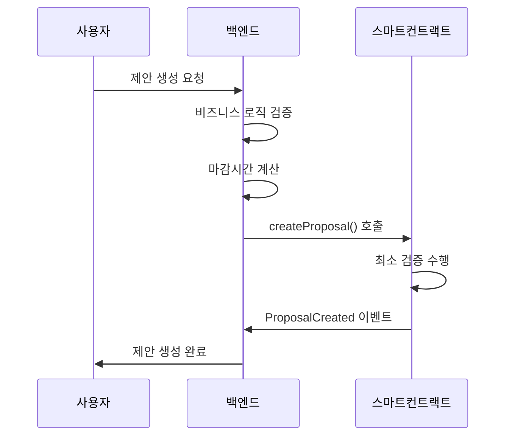
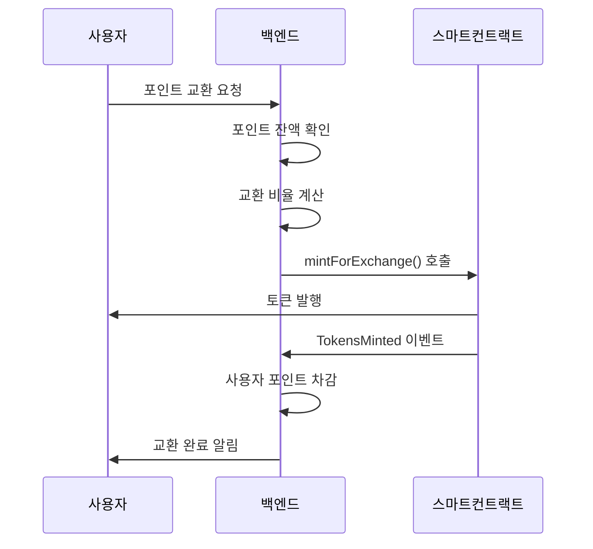

# GovernanceToken 스마트 컨트랙트 기술 문서

## 개요

GovernanceToken은 투표 기능이 내장된 ERC20 토큰으로, 백엔드와의 하이브리드 아키텍처를 통해 가스비 효율성과 운영 유연성을 동시에 확보한 거버넌스 시스템입니다.

## 핵심 특징

### 🎯 주요 기능
- **ERC20 호환 토큰**: 표준 토큰 전송 및 잔액 관리
- **거버넌스 투표**: 제안 생성, 투표, 실행 시스템
- **투표권 위임**: ERC20Votes 기반 위임 기능
- **백엔드 제어 민팅**: 포인트-토큰 교환 시스템
- **보안 메커니즘**: 재진입 방지, 일시정지, 소유자 제어

### 🏗️ 아키텍처 설계 철학
- **스마트 컨트랙트**: 핵심 로직만 처리 (가스비 최적화)
- **백엔드 시스템**: 복잡한 비즈니스 로직 및 상태 관리
- **하이브리드 상호작용**: 최적의 성능과 유연성 확보

## 컨트랙트 구조

### 상속 관계
```
GovernanceToken
├── ERC20 (기본 토큰 기능)
├── ERC20Votes (투표 기능 확장)
├── Ownable (소유자 권한 관리)
├── Pausable (일시정지 기능)
└── ReentrancyGuard (재진입 공격 방지)
```

### 핵심 상수
```solidity
uint256 public constant MIN_VOTING_POWER = 1e18; // 최소 투표 권한: 1 토큰
```

## 함수별 상세 설명

### 🪙 토큰 발행 함수

#### `mintForExchange(address to, uint256 amount, string reason)`
**역할**: 개별 사용자에게 토큰 발행
- **접근 권한**: 소유자(백엔드) 전용
- **보안**: `onlyOwner`, `whenNotPaused`, `nonReentrant`
- **용도**: 포인트-토큰 교환, 리워드 지급
- **감사**: `reason` 파라미터로 발행 이유 기록

#### `batchMint(address[] recipients, uint256[] amounts, string reason)`
**역할**: 다수 사용자에게 일괄 토큰 발행
- **효율성**: 가스비 절약을 위한 배치 처리
- **검증**: 배열 길이 일치성, 빈 배열 방지
- **용도**: 대규모 에어드랍, 월별 리워드 배분

### 🗳️ 거버넌스 함수

#### `createProposal(string description, uint256 deadline)`
**역할**: 새로운 거버넌스 제안 생성
- **자격 요건**: 최소 1 토큰 이상 보유
- **백엔드 제어**: 마감시간을 백엔드에서 완전 제어
- **유연성**: 제안별 맞춤형 투표 기간 설정 가능

```solidity
// 백엔드에서 제안 타입별 마감시간 제어 예시
switch (proposalType) {
    case 'urgent': deadline = now + 24시간;
    case 'standard': deadline = now + 7일;
    case 'important': deadline = now + 14일;
}
```

#### `vote(uint256 proposalId, bool support)`
**역할**: 제안에 대한 찬성/반대 투표
- **투표 권한**: 현재 토큰 보유량 기준
- **중복 방지**: 동일 제안에 대한 재투표 차단
- **가중치**: 토큰 보유량에 비례한 투표 권한

#### `executeProposal(uint256 proposalId)`
**역할**: 통과된 제안 실행
- **실행 조건**: 투표 마감 후 찬성표 > 반대표
- **상태 변경**: 제안 상태를 '실행됨'으로 변경

#### `delegateVoting(address delegatee)`
**역할**: 투표권을 다른 주소에 위임
- **ERC20Votes 활용**: 표준 위임 메커니즘 사용
- **유연성**: 활성 참여자에게 투표권 집중 가능

### 📊 조회 함수

#### `getVotingPower(address account)`
**역할**: 특정 주소의 현재 투표 권한 조회
- **실시간 반영**: 현재 위임 상태 및 토큰 보유량 기준

#### `getVoteInfo(uint256 proposalId, address voter)`
**역할**: 특정 제안에 대한 투표 정보 조회
- **반환값**: 투표 여부, 투표 시점의 권한 수치

#### `getProposal(uint256 proposalId)`
**역할**: 제안의 상세 정보 조회
- **포함 정보**: 설명, 제안자, 투표 결과, 마감시간, 상태

### 🛡️ 관리 함수

#### `pause()` / `unpause()`
**역할**: 긴급 상황 시 컨트랙트 일시정지/재개
- **영향 범위**: 모든 상태 변경 함수 중단
- **조회 함수**: 정상 작동 유지

#### `cancelProposal(uint256 proposalId)`
**역할**: 부적절한 제안 취소
- **권한**: 소유자(백엔드) 전용
- **제한**: 이미 실행된 제안은 취소 불가

## 백엔드 하이브리드 아키텍처

### 🚀 가스비 최적화 전략

#### 스마트 컨트랙트 역할 (온체인)
- **핵심 로직만 처리**: 토큰 전송, 투표, 제안 실행
- **최소한의 검증**: 필수 보안 검증만 수행
- **상태 변경**: 블록체인 불변성이 필요한 데이터만 저장

#### 백엔드 시스템 역할 (오프체인)
- **복잡한 비즈니스 로직**: 투표 기간 결정, 제안 검증
- **상태 관리**: 제안 상태, 사용자 알림, 통계
- **성능 최적화**: 데이터 캐싱, 빠른 조회

### 💡 하이브리드 상호작용 예시

#### 제안 생성 플로우


#### 토큰 발행 플로우


### 📈 성능 최적화 효과

#### 가스비 절약
- **단순한 검증 로직**: 복잡한 조건문 제거
- **백엔드 전처리**: 잘못된 요청 사전 차단
- **배치 처리**: `batchMint`로 대량 작업 효율화

#### 운영 유연성
- **실시간 정책 변경**: 백엔드 코드 수정만으로 규칙 변경
- **A/B 테스트**: 다양한 투표 기간 정책 실험
- **모니터링**: 상세한 로깅 및 분석

#### 사용자 경험
- **빠른 응답**: 조회 기능의 백엔드 캐싱
- **실시간 알림**: 제안 상태 변경 즉시 알림
- **직관적 인터페이스**: 복잡한 블록체인 로직 추상화

## 보안 고려사항

### 🔒 다층 보안 구조

#### 스마트 컨트랙트 레벨
- **ReentrancyGuard**: 재진입 공격 방지
- **Pausable**: 긴급 상황 대응
- **Ownable**: 권한 기반 접근 제어

#### 백엔드 레벨
- **요청 검증**: 잘못된 파라미터 사전 차단
- **비즈니스 로직**: 복잡한 규칙 검증
- **감사 로그**: 모든 작업 기록 및 추적

#### 운영 레벨
- **권한 분리**: 개발/운영 환경 분리
- **모니터링**: 이상 거래 실시간 감지
- **백업**: 중요 데이터 다중 백업

## 배포 및 운영

### 🚀 배포 과정
1. **스마트 컨트랙트 배포**: 메인넷/테스트넷 배포
2. **백엔드 연동**: 컨트랙트 주소 및 ABI 설정
3. **이벤트 리스너 구성**: 블록체인 이벤트 모니터링
4. **초기 설정**: 소유자 권한 이전 및 보안 검증

### 📊 모니터링 지표
- **가스 사용량**: 함수별 가스 소모 추적
- **트랜잭션 성공률**: 실패 원인 분석
- **사용자 참여도**: 투표 참여율, 제안 생성 빈도
- **시스템 성능**: 응답 시간, 처리량

## 결론

GovernanceToken은 블록체인의 투명성과 불변성을 유지하면서도, 백엔드 시스템의 유연성과 효율성을 활용한 하이브리드 아키텍처를 구현합니다. 이를 통해:

- **가스비 최적화**: 불필요한 온체인 연산 최소화
- **운영 유연성**: 비즈니스 요구사항 변화에 신속 대응
- **확장성**: 대용량 사용자 및 거래 처리 가능
- **보안성**: 다층 보안 구조로 안전성 확보

이러한 설계를 통해 실제 프로덕션 환경에서 안정적이고 효율적인 거버넌스 시스템을 운영할 수 있습니다.